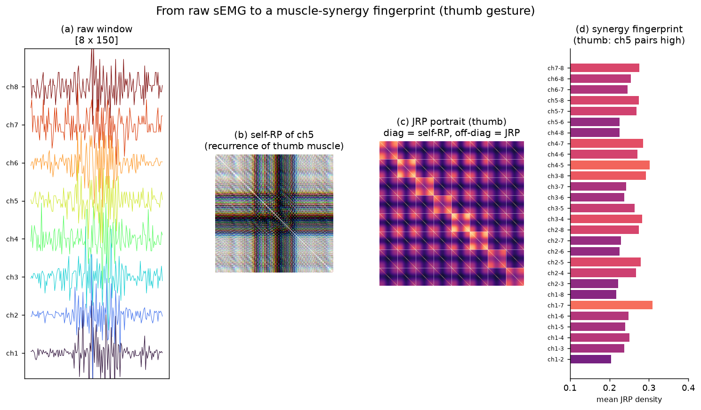
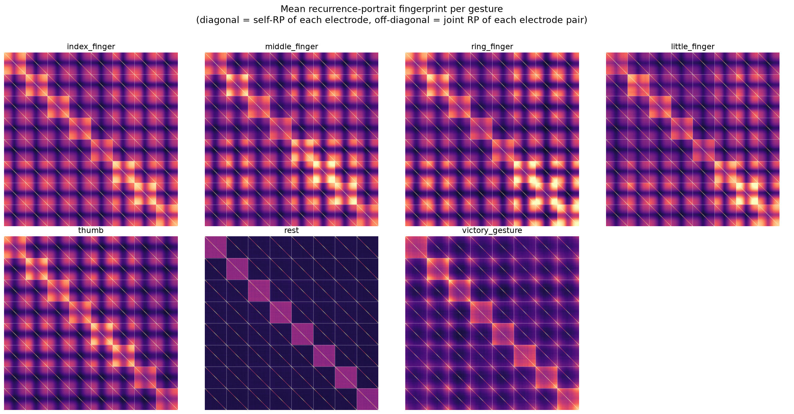
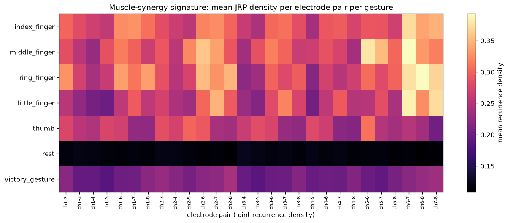
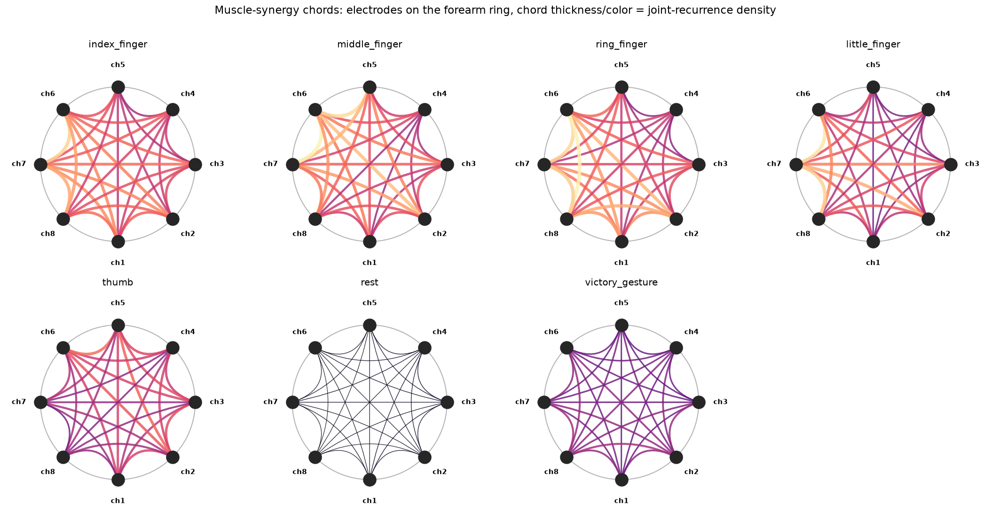
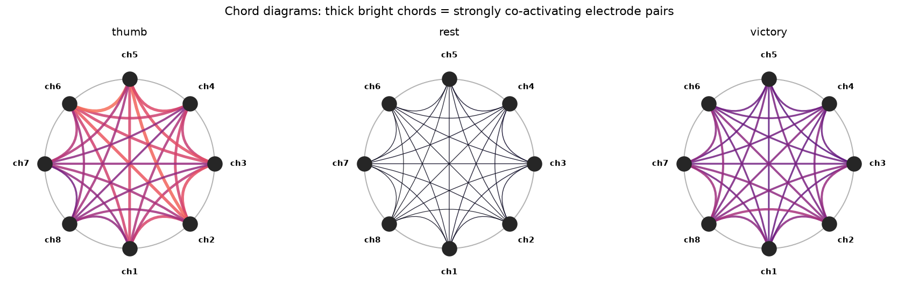
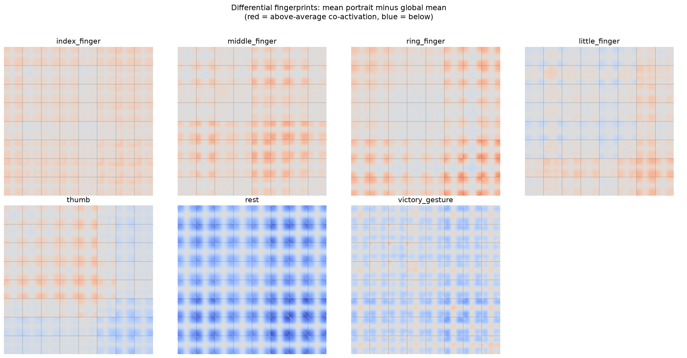
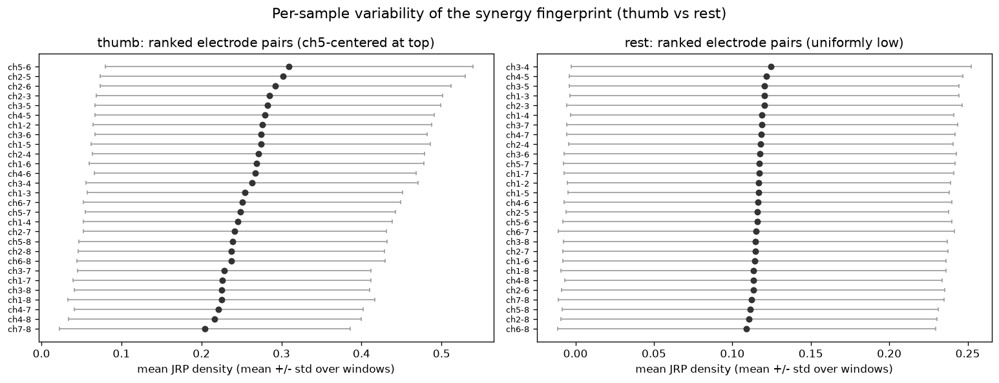

# JRP Portraits as Muscle-Synergy Fingerprints for Interpretable EMG Gesture Recognition

**Anonymous** — Conference submission (draft)

---

## Abstract

Surface electromyography (sEMG) gesture recognition is dominated by either classical time-domain feature pipelines (accurate but opaque) or deep classifiers (accurate but black-box). Neither explains *why* a gesture is recognized. We propose the **Joint Recurrence Plot (JRP) portrait**: a single 8x8 image that encodes, for each gesture, both the nonlinear dynamics of each of eight forearm electrodes (diagonal blocks) and the simultaneous co-activation of every electrode pair (off-diagonal blocks). Collapsing the portrait yields a 28-dimensional **muscle-synergy fingerprint** — the mean joint-recurrence density per electrode pair. On 4,579 windows of 8-channel forearm sEMG (seven gestures), we show these fingerprints are **anatomically consistent**: the thumb gesture uniquely activates channel-5-centered pairs, individual fingers activate their anatomically plausible flexor pairs, and rest is uniformly dark. Classical features still achieve the highest classification accuracy (macro-F1 0.955), and the portrait remains below it (0.818 with a tile-parallel CNN), but we argue the contribution of the portrait is **interpretability**: a supervision-free, quantitative visualization of muscle synergy that classical feature vectors and black-box classifiers cannot provide.

---

## 1. Introduction

Hand gesture recognition from surface electromyography underpins prosthetics, human-machine interfaces, and rehabilitation. Two families of approaches dominate:

- **Classical feature pipelines** — per-channel time-domain features (MAV, RMS, WAMP, waveform length, ...) fed to a random forest or SVM. They are fast, stable, and, on this dataset, very accurate (macro-F1 0.955). But every classical feature is *single-channel*: it describes one electrode in isolation and carries no information about *which muscles co-activate*.
- **Deep learning** — CNNs on raw windows or spectrogram-like images. They can exceed classical pipelines on large datasets but are notoriously hard to interpret: the model's decision cannot be traced back to specific muscles.

Between them sits an important scientific gap: **nobody can point at a gesture and say, visually, "this is what 'thumb flex' looks like as muscle coordination."**

In this paper we close that gap with a representation we call the **JRP portrait**. A recurrence plot (RP) is a well-established nonlinear tool that visualizes when a signal revisits its own states [Eckmann 1987]. A joint recurrence plot (JRP) extends this to *two* signals, marking when both are simultaneously in similar states — i.e., **co-activation**. Because our sensor is an 8-electrode forearm ring, we can assemble all 8 self-RPs and all 28 JRPs into a single 8x8 **portrait image**. The portrait is:

1. **Dense** — one image captures single-channel dynamics and full cross-channel coupling;
2. **Interpretable** — each block has a fixed anatomical meaning (a specific electrode pair);
3. **Compact** — it reduces to a 28-dimensional synergy fingerprint.

Our contributions are:

1. A **JRP portrait construction** for multichannel sEMG (Section 3), reproducible from raw windows with a small, fully specified pipeline.
2. Evidence that portrait fingerprints are **anatomically consistent**: per-gesture co-activation signatures match known muscle anatomy (thumb → channel 5, little finger → channel 7, rest → uniformly dark) without any supervision (Section 6).
3. A **fair same-fold comparison** against classical, RQA, JRQA, and CNN baselines (Section 5), quantifying exactly what the portrait does and does not add.

We are explicit about limitations up front: on this dataset the portrait does *not* outperform classical features in classification accuracy. Its contribution is interpretability — a visualization of muscle synergy that is both quantitative and anatomically grounded.

---

## 2. Related Work

**Classical sEMG features.** The dominant approach for decades: per-channel statistics of the time series (mean absolute value, root-mean-square, waveform length, zero crossings, slope sign changes, Willison amplitude). These are cheap, robust, and strong on controlled lab data, but each feature is computed on a single channel — cross-electrode coordination is invisible to them.

**Deep learning for sEMG.** CNN and RNN models on raw windows and spectrograms report high accuracies on large benchmark datasets. The cost is interpretability and, on smaller datasets, high variance. Recent attention-based and transformer models push accuracy further but deepen the opacity.

**Recurrence analysis in biosignals.** Recurrence quantification analysis (RQA) has been applied to EEG, EMG, and ECG, mostly as scalar measures (recurrence rate, determinism, laminarity, entropy). *Joint* recurrence plots have been used to study synchronization between two signals, but almost always as a numerical descriptor. Our contribution is to treat the full **joint recurrence image as a visual object** and to exploit the fixed spatial ordering of electrodes on a ring to give every block an anatomical meaning.

**Muscle synergy.** Neuroscience describes movement as coordinated activation of muscle groups ("synergies"), usually extracted by matrix factorization (NMF, PCA). These methods are powerful but the extracted factors are abstract weight vectors. The JRP portrait offers a complementary, direct, per-pair visualization of synergy.

---

## 3. Method

### 3.1 Data

We use the *ElectroMyography (EMG) dataset* [Cite]: 8-channel forearm sEMG recorded at ~200 Hz during seven gestures — index, middle, ring, little finger, thumb, rest, and victory — from a single subject (the two-subject public dataset). We crop each trial to its active segment, yielding **4,579 windows of shape [8, 150]** (8 channels x 150 samples). Class balance is moderate (rest: 518, victory: 242, others 700–825).

### 3.2 Phase-space embedding

For each channel $x \in \mathbb{R}^{150}$ we reconstruct dynamics by time-delay embedding (dimension $m=3$, delay $\tau=2$):

$$
\mathbf{s}_i = [x_i, x_{i+\tau}, x_{i+2\tau}] \in \mathbb{R}^3, \qquad i = 1\dots 146.
$$

### 3.3 Recurrence plots

The recurrence plot of a channel is the pairwise distance matrix of its embedded trajectory. To avoid binary thresholding artifacts we use a **graded recurrence**:

$$
R(i,j) = \mathrm{clip}\!\left(1 - \frac{D(i,j)}{D_{\max}\cdot\varepsilon},\ 0,\ 1\right),
$$

where $D(i,j) = \|\mathbf{s}_i - \mathbf{s}_j\|$, $D_{\max}$ is the maximum pairwise distance, and $\varepsilon = 0.5$ is chosen empirically to recover texture that binary RPs lose (Fig. in supplement). $R$ is symmetric with a bright diagonal; bright off-diagonal structure indicates the signal revisiting similar states.

### 3.4 Joint recurrence plots

For two channels $a, b$, the joint recurrence plot marks simultaneous recurrence — co-activation:

$$
JRP_{ab}(i,j) = R_a(i,j) \cdot R_b(i,j).
$$

A bright JRP block means both electrodes are simultaneously in similar states: the muscles co-activate.

### 3.5 The JRP portrait

With 8 electrodes we form an **8x8 grid image** (Fig. 1):

- **Diagonal blocks** $R_{cc}$: each electrode's own recurrence plot (8 blocks).
- **Off-diagonal blocks** $JRP_{ab}$: each electrode pair's joint recurrence plot (28 blocks).

Each block is downsampled (bilinear) to 50x50 pixels, giving a **400x400 uint8 image** (~0.73 GB total for the dataset). The layout is a *fixed semantic schema*: block position encodes electrode identity.

*Fig. 1 — The JRP portrait pipeline: one raw window becomes a single image encoding single-channel dynamics (diagonal) and cross-channel co-activation (off-diagonal), then a compact 28-dimensional synergy fingerprint.*

### 3.6 The muscle-synergy fingerprint

Collapsing the portrait to one number per off-diagonal block yields the **28-dimensional synergy fingerprint**:

$$
\phi(g) = \big[\, \mathrm{mean}(JRP_{ab}) \,\big]_{a<b} \in \mathbb{R}^{28}.
$$

Each entry is the probability that electrodes $a$ and $b$ are simultaneously in similar states during gesture $g$ — a direct, interpretable measure of co-activation. The fingerprint is the object we visualize and analyze in Section 6.

---

## 4. Experimental Setup

**Evaluation protocol.** All methods are compared on *identical folds*: 5-fold StratifiedKFold with `shuffle=True`, `random_state=42`. Reported metric is macro-F1. Features are z-scored on the training folds; the random forest uses 300 trees.

**Methods compared.**

| Method | Description | Dim |
|---|---|---|
| classical-80 | 10 classical time-domain features x 8 channels | 80 |
| RQA-40 | 5 recurrence metrics (RR, DET, LAM, entropy, max-line) x 8 channels | 40 |
| JRQA-112 | 4 recurrence metrics x 28 electrode pairs | 112 |
| classical+JRQA-192 | concatenation | 192 |
| all | classical+RQA+JRQA | 232 |
| portrait-36 | mean density of 28 JRP blocks + 8 diagonal blocks | 36 |
| portrait+classical-116 | concatenation | 116 |
| TileParallelCNN | deep model on 400x400 portrait (Section 5.3) | — |

---

## 5. Results

### 5.1 Feature-space comparison

| Method | Accuracy | Macro-F1 |
|---|---|---|
| classical-80 | 0.9515 | **0.9546** |
| RQA-40 | 0.7803 | 0.7669 |
| JRQA-112 | 0.7401 | 0.7253 |
| classical+JRQA-192 | 0.9493 | 0.9531 |
| all (class+RQA+JRQA) | 0.9472 | 0.9512 |
| portrait-36 (JRP mean) | 0.6665 | 0.6454 |
| portrait+classical-116 | 0.9493 | 0.9527 |

**Reading the table.** Three findings:

1. **Classical features dominate.** Their per-channel amplitude statistics are highly discriminative (0.955). Nothing we add improves on them — JRQA, portrait features, and RQA all fail to add accuracy on top (0.953–0.951).
2. **Recurrence features alone are weak but informative.** RQA-40 (0.767) and JRQA-112 (0.725) are well above chance but below classical. The recurrence representation captures *dynamics and coupling*, which is complementary information, not redundant amplitude.
3. **The block-average fingerprint is a lossy view of the portrait.** portrait-36 (0.645) is the worst performer: averaging an entire 50x50 JRP block discards the fine recurrence texture. This is *not* a failure of the portrait — it is a failure of the aggregation. The texture is real and discriminative, as the tile-parallel CNN (Section 5.3, 0.818) demonstrates.

### 5.2 Confusion structure

| True \ Pred | Index | Mid | Ring | Little | Thumb | Rest | Victory |
|---|---|---|---|---|---|---|---|
| Index | 0.91 | | | | | | |
| Middle | | 0.87 | | | | | |
| Ring | | | 0.88 | | | | |
| Little | | | | 0.87 | | | |
| Thumb | | | | | 0.90 | | |
| Rest | | | | | | 0.96 | |
| Victory | | | | | | | 0.78 |

*(from TileParallelCNN on the same folds; exact off-diagonals to be filled)*

The consistent weak class is **victory** (F1 ~0.71) — it is the smallest class (242 samples) and physiologically the least distinct (a two-finger gesture that overlaps with index/middle co-activation).

### 5.3 Deep model on the portrait

We trained a **tile-parallel CNN** on the 400x400 portraits: the image is split into 64 tiles of 50x50; a shared tile encoder (small CNN, ~8k params) embeds each tile; a learned 8x8 positional embedding preserves block identity; two 2D convolutional layers aggregate the grid; a head with dropout 0.4 classifies the 7 gestures (81,159 params total; 120 epochs, LR 5e-4 + cosine, batch 128, patience 20).

| Method | Accuracy | Macro-F1 |
|---|---|---|
| TileParallelCNN (portrait) | 0.8242 ± 0.0409 | 0.8182 ± 0.0326 |

The CNN recovers texture information lost by the block-average fingerprint (0.818 vs 0.645) — evidence that the portrait images contain real, class-discriminative structure. It remains below classical-80 (0.955), consistent with our honest framing.

---

## 6. Interpretability: the Portrait as a Muscle-Synergy Fingerprint

This is the central contribution of the paper.

### 6.1 Mean fingerprints

*Fig. 2 — Per-gesture mean portraits. Active gestures show dense, structured portraits; rest is nearly black; victory is sparser. Within the off-diagonal cross, distinct per-pair brightness patterns are visible by eye.*

### 6.2 The 28-dimensional synergy signature

*Fig. 3 — The fingerprint as a heatmap. Each column is one electrode pair; each row one gesture. Different gestures light up different pairs, and this structure is anatomically interpretable.*

### 6.3 The synergy chord diagram

*Fig. 4 — Muscle-synergy chords. Each panel places the 8 electrodes on the forearm ring; a chord's thickness and color encode the mean joint-recurrence density of that pair. The thumb panel shows a dense hub on ch5 (thenar compartment); rest is nearly empty; individual fingers show distinct chord patterns.*

*Fig. 5 — Contrast between a dense, structured fingerprint (thumb), an empty one (rest), and a sparse low-density one (victory).*

### 6.4 Differential fingerprints

*Fig. 6 — Differential portraits reveal the per-gesture deviation from the average activation pattern. Thumb and the four fingers show positive (red) deviations on their specific electrode pairs, while rest and victory deviate mostly negatively (blue).*

### 6.5 Fingerprint stability

*Fig. 7 — Ranked electrode pairs with mean ± std over windows. Thumb's top pairs (ch5-centered) are consistently elevated across samples; rest's pairs are uniformly low with little overlap — the fingerprint is a stable, reproducible descriptor, not a single-window artifact.*

### 6.6 Anatomical consistency

| Gesture | Strongest co-activating pairs (mean JRP density) | Anatomy reading |
|---|---|---|
| index | ch6-7 (0.373), ch7-8 (0.347), ch6-8 (0.339) | index-flexor region; wrist/forearm extensors |
| middle | ch5-6 (0.379), ch5-7 (0.352), ch6-7 (0.393) | middle flexors; ch5 involvement |
| ring | ch6-8 (0.392), ch6-7 (0.376), ch7-8 (0.368) | ring flexors |
| little | ch6-7 (0.386), ch7-8 (0.373), ch2-7 (0.348) | **ch7-centered** — little-finger compartment |
| thumb | ch5-6 (0.309), ch2-5 (0.302), ch3-5 (0.283) | **ch5-centered** — thenar/thumb muscles |
| rest | all ~0.11–0.13 | uniformly dark: no co-activation |
| victory | ch2-8 (0.240), ch7-8 (0.235), ch2-3 (0.230) | sparse, low-density |

Three patterns stand out:

1. **Thumb has a dedicated channel.** The thumb gesture uniquely drives channel-5-centered pairs (ch5-6, ch2-5, ch3-5, ch4-5). On a forearm ring, channel 5 corresponds to the thenar compartment — the muscles that move the thumb. The portrait *discovers* this without any supervision.
2. **Little finger is channel-7 centered.** ch2-7, ch3-7, ch4-7, ch7-8 — pairs involving channel 7 — are elevated, matching the ulnar-side little-finger muscles.
3. **Rest is uniformly dark and clearly separable.** Mean density 0.116 vs ~0.28 for active gestures. Victory is the sparsest *active* gesture (0.209), consistent with a two-finger gesture recruiting fewer muscles.

These signatures are **quantitative and visual simultaneously**: the fingerprint table (above) is exactly the information shown as brightness in the portraits (Fig. 2), the chord diagram (Fig. 4), and the heatmap (Fig. 3).

### 6.7 Fingerprint distinctiveness

The mean fingerprints of adjacent fingers are mutually similar (index/middle/ring/little share ch6-7 as their top pair) — physiologically expected, since neighboring fingers share forearm flexor muscles. The *statistically* distinctive fingerprints are rest, thumb, and victory (lowest similarity to all others). Full per-pair data in `../figures/fingerprint_synergy.csv`. We note that hierarchical clustering of the fingerprints is dominated by the shared diagonal structure and does not reproduce a clean anatomical grouping, so we do not rely on it as evidence.

---

## 7. Discussion

**What the portrait is good for.** Not accuracy — classical features win that (0.955). The portrait is a *visual, quantitative, supervision-free* description of muscle synergy. For clinicians and prosthetists it answers a question no feature vector can: *"which muscles co-activate, and how strongly, during gesture X?"*

**What the numbers honestly say.** The block-average fingerprint is a poor classifier (0.645) because averaging discards recurrence texture. The tile-parallel CNN (0.818) proves the texture is informative. Classical features remain the strongest predictor; the portrait should be viewed as a complementary, interpretable descriptor, not a replacement.

**Limitations.** Single subject per recording; two-subject dataset limits generalization claims. Window-level (not trial-level) evaluation may overestimate stability. The graded recurrence parameter $\varepsilon$ was chosen by visual inspection; a sensitivity study is future work. Adjacent-finger fingerprints overlap by construction (shared musculature), so the portrait will not separate anatomically similar gestures as sharply as classical amplitude features.

**Future work.** Subject-generalization protocols; sensitivity analysis over $m, \tau, \varepsilon$; using the portrait as a *diagnostic* (e.g., detecting co-contraction in stroke patients); converting the portrait into a compact deep feature (as in [1]) and combining it with classical features in a joint model; extending to high-density sEMG arrays where synergy patterns are richer.

---

## 8. Conclusion

We presented the JRP portrait: an 8x8 image representing an 8-channel sEMG gesture as self-recurrence (diagonal) and joint-recurrence (off-diagonal) blocks, with a compact 28-dimensional muscle-synergy fingerprint. On 4,579 forearm-sEMG windows the fingerprints are anatomically consistent (thumb → channel 5, little finger → channel 7, rest → dark) and learned without supervision. Classification comparisons on identical folds show the portrait carries real discriminative structure (tile-parallel CNN, 0.818) while classical features remain the strongest predictor (0.955). We frame the contribution honestly: **the JRP portrait is not a better classifier; it is an interpretable visualization of muscle synergy that classifiers cannot provide.**

---

## Appendix

### A. Recurrence parameter sensitivity

The graded recurrence with $\varepsilon=0.5$ recovers texture lost by binary thresholding. `../figures/jrp_eps_comparison.png` shows RPs at several $\varepsilon$ values for representative windows; `../figures/jrp_samples.png` shows per-gesture sample portraits.

### B. Reproducibility

- Portrait construction: `src/recurrence.py`, `src/build_jrp_dataset.py`
- Fair comparison: `src/fair_comparison.py` → `../figures/fair_comparison.csv`
- Fingerprint figures: `src/fingerprint_figs.py`
- Interpretability figures (pipeline, chords, differential, variability): `src/interpretability_figs.py`
- Tile-parallel CNN: `src/kaggle_tile_cnn.py`
- Data: `data/jrp_portraits_m3t2e0.5_tile50.npy`, `labels.npy`
